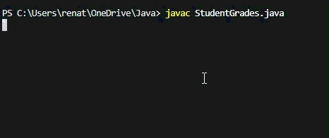
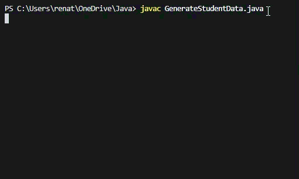

# Parte prática
## Ambiente Utilizado 
Foi escolhido para a execução dos códigos vistos na última aula, o VS Code com extensão para Java. Decidi trabalhar nesse ambiente pois é o que sempre uso e já estou familiarizada.

### Comandos
Compilar - javac NomeArquivo.java

Executar - java NomeArquivo

### Execução
Para StudentGrades, o programa vai ler o arquivo students.csv e transformar cada linha em um objeto de programação e calcular a média da nota dos alunos.



Para GenerateStudentData, o programa acessa a API randomuser.me para obter nomes reais de brasileiros, transforma os dados da internet em objetos da classe Student dentro do Java e atribui automaticamente uma nota entre 5.0 e 10.0 para cada aluno criado. Depois salva a lista completa em um arquivo CSV.



# Parte Teórica
## 2 perguntas do código GenerateStudentData
7. O que significa try dentro de fetchJson?

   O comando try funciona como uma proteção para o programa.
   Ele basicamente diz ao computador para "tentar" acessar a internet e buscar os nomes dos alunos. Isso é necessário por que conexões de rede podem falhar (internet lenta, site fora do ar). Então o try garante que, se algo der errado, o programa não "trave" nem feche sozinho.
   
   Desse modo temos o Plano B (catch), que serve para que caso ocorra uma falha na conexão, o código pula para uma mensagem de erro, explicando o que aconteceu em vez de interromper a execução bruscamente.

13. Como este programa se comporta sem acesso à internet?

    O programa possui tratamento de erros para falhas de conexão como expliquei anteriormente com o try/catch. Então caso o usuário esteja sem internet, o sistema não interrompe a execução, em vez disso, ele captura a falha, mostra uma mensagem de erro ao tentar conexão com a API e mesmo assim gera o arquivo CSV utilizando o nome padrão 'Unknown' para os estudantes, com IDs e Notas aleatórias.

# Parte Exploratória
Escolhi o projeto TEAMMATES. É um sistema que permite aos usuários escrever comentários anônimos sobre seus colegas, professores e alunos. Além de permitir que você crie várias enquetes (anônimas ou não), os membros do mesmo grupo podem avaliar as contribuições uns dos outros para os projetos, enquanto os professores podem deixar seus comentários para os alunos.

Link: https://github.com/TEAMMATES/teammates

Arquivo que contém parte do trecho escolhido: https://github.com/TEAMMATES/teammates/blob/master/src/main/java/teammates/logic/api/UserProvision.java
### Trecho do código

```java
/**
 * Handles logic related to username and user role provisioning.
 */
public class UserProvision {

    private static final UserProvision instance = new UserProvision();

    private final UsersLogic usersLogic = UsersLogic.inst();

    UserProvision() {
        // prevent initialization
    }
```

-A classe UserProvision atua como um provedor de identidade: ela identifica quem é professor e quem é aluno. Ela centraliza a lógica de descobrir quem é o usuário atual através de cookies de quem acessa o sistema.

-Usei o conceito de ponteiros para entender o que a linha private static final UserProvision instance = new UserProvision(); estava fazendo, pois foi onde tive mais dificuldade. Em resumo, essa estrutura serve para não criar uma nova instância do serviço toda vez que alguém precisa de uma informação, mas sim apontar para o 'serviço oficial' que gerencia essas identidades. Isso garante que o sistema não crie vários objetos da classe UserProvision na memória, mantendo o controle centralizado."

-Identifiquei o uso de composição na linha private final UsersLogic usersLogic = UsersLogic.inst();. Aqui, a classe UserProvision estabelece uma conexão fixa com outra classe chamada UsersLogic. Entendi que isso serve para separar as tarefas, ou seja, enquanto a UserProvision foca em identificar quem está acessando o sistema via cookies, ela atribui para a UsersLogic a tarefa de validar as regras desses usuários. O que um professor pode ou não fazer, o mesmo para um usuário aluno.
